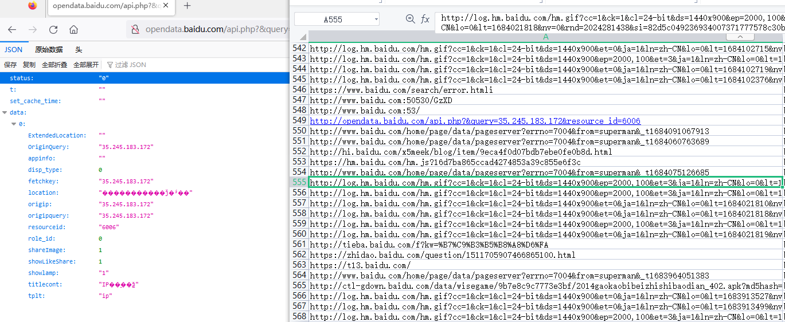
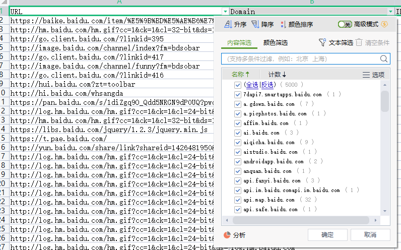
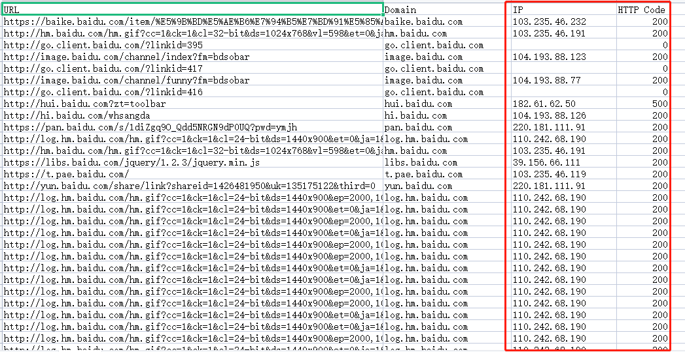
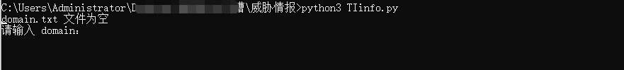
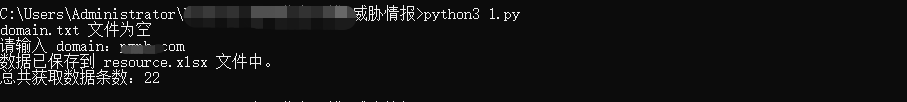
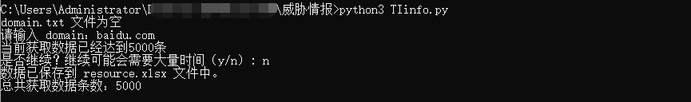

# TIinfo

一款数据来源于AlienVault开源威胁情报的信息收集工具。

可收集目标域名相关的子域名、IP地址、敏感url地址、网站状态响应码等，同时支持单域名查询、多域名查询以及输出xlsx文件。

## 主要功能

1.收集目标域名的敏感信息例如api、后台登录地址、敏感文件等信息。

2.收集目标域的子域名信息。

3.收集目标域名的子域名和网站响应状态码。

4.其他功能

- 单域名/批量域名信息收集
- 自定义输出信息条数
- 文件保存

## 使用方法

**1.单域名查询：**

python3 TIinfo.py

输入想查询的domain信息

默认查询5000条数据，如果目标域名信息大于5000条将会提示是否继续查询，继续可能需要大量时间，根据使用者使用情况自行输入。

**2.批量域名查询**

将目标域名填写至domain.txt文件中。

执行python3 TIinfo.py，脚本将会查询完资产信息之后输出到resource.xlsx文件中。

